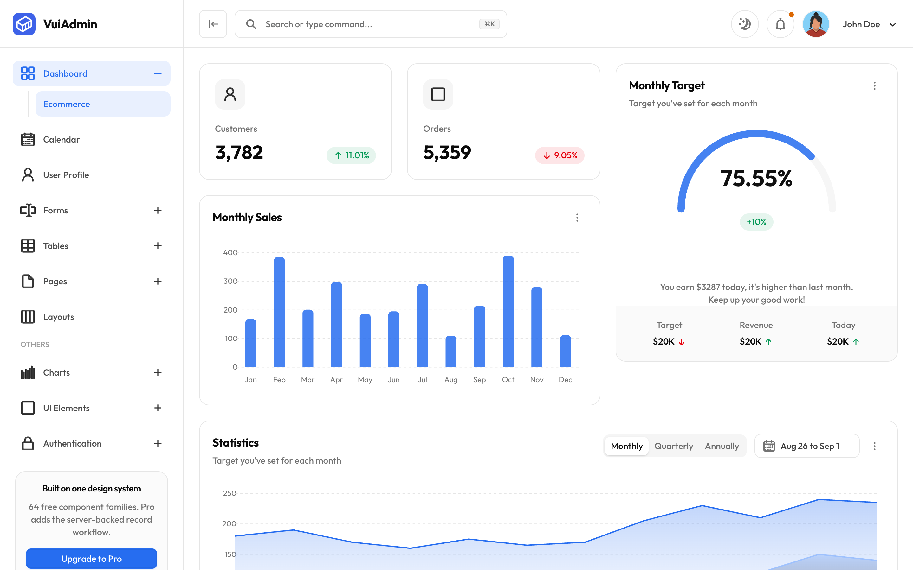
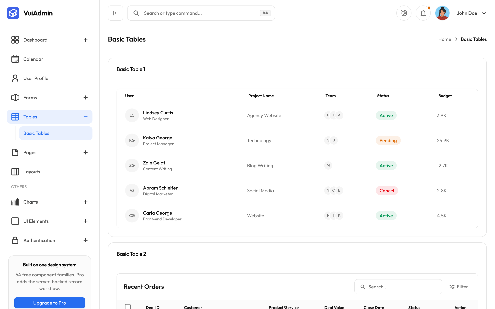
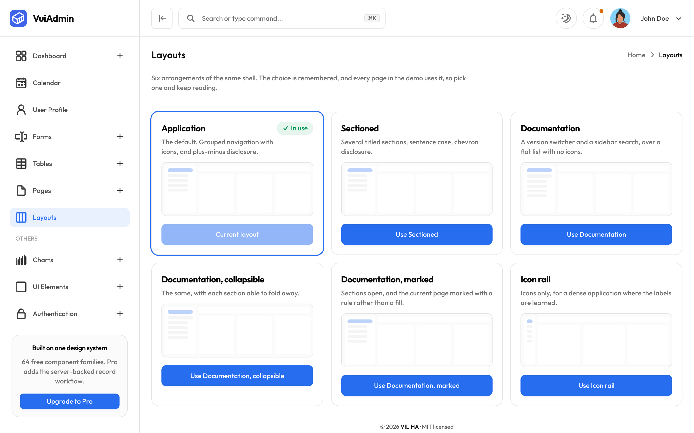

# VuiAdmin HTML: Free HTML Admin Dashboard Template

[](https://docs.viliha.com/docs/installation/html)
[](https://html.viliha.com)
[](https://html.viliha.com)
[](./LICENSE)
[](https://github.com/myviliha/free-html-admin-dashboard/actions/workflows/deploy.yml)
[](https://github.com/sponsors/myviliha)

## ❤️ Sponsoring is what keeps this free

VuiAdmin is the kind of admin theme that usually gets sold. We keep it MIT, and sponsors are what make
that possible.

Six framework editions of the same nineteen screens is more work than it sounds. A card has to be the
same card in HTML as it is in the other five. Dark mode has to invert properly rather than
wash out. Every control needs keyboard and screen-reader behaviour, and every edition needs the parity
checks that stop them quietly drifting apart. We do that so you do not have to build it or buy it.

**Even $1 a month helps.** It goes toward bug fixes, new screens, and keeping the demos and docs
current. Honestly, it is what keeps us building in the open.

> Sponsors are listed on the [GitHub Sponsors page](https://github.com/sponsors/myviliha) and get our
> genuine thanks.

### 👉 [Sponsor on GitHub →](https://github.com/sponsors/myviliha) &nbsp;·&nbsp; thank you 🙏

---

**VuiAdmin** is a free, open-source **HTML admin dashboard template** built on **Tailwind CSS v4**. Nineteen finished screens (dashboard, tables, forms, calendar, charts, authentication), MIT licensed, with no account, no key and no trial.

This is the **HTML** edition, and it is the plainest thing in the set: nineteen `.html` files, one
stylesheet, four small scripts. **No build step, no framework, no `npm install`.** Clone it and open
`index.html`.

It exists because plenty of projects are not a React project: a Django or Rails or Laravel app, a
static marketing site, a CMS theme, a page inside something older. The markup here is the same
markup the React edition renders, so you can lift a card or a table out of one of these files and
paste it where you need it.

**Plain HTML5 · one compiled stylesheet · four small scripts · no build step**

The same dashboard also ships for React, Next.js, Vue, Angular and Laravel, all from one design
system, so you can change stack without changing product. [See all six editions](#all-six-editions).

---

## Documentation

The full documentation is at **[docs.viliha.com](https://docs.viliha.com)**: installation for every
edition, the folder structure, the app layout and the six shells, every component family, theming
and dark mode, breakpoints, and deployment.

- [Install the HTML edition](https://docs.viliha.com/docs/installation/html)
- [Project structure](https://docs.viliha.com/docs/structure/html)
- [Colours and tokens](https://docs.viliha.com/docs/customization/colors)
- [Dark mode](https://docs.viliha.com/docs/customization/dark-mode)
- [Deployment](https://docs.viliha.com/docs/deployment)
- [FAQ](https://docs.viliha.com/docs/faq)

This README is the short version. Anything it leaves out is in the docs.

---





| Form elements | Calendar |
| ------------- | -------- |
| [](./docs/screenshots/forms.png) | [](./docs/screenshots/calendar.png) |

| Six shell layouts | Sign in |
| ----------------- | ------- |
| [](./docs/screenshots/layouts.png) | [](./docs/screenshots/signin.png) |

Every edition renders these same screens from the same fixtures, which is the whole point of the
design system underneath them, so one set of shots is the honest set for all six. Dark mode is the
toggle in the header on every screen.

---

## What is free and what is Pro

**Everything in this repository is free and MIT.** That is not a trial and it does not expire: every
version already published is MIT permanently, so nothing listed as free can move behind a paywall
later.

| Area | Free | Pro |
| --- | --- | --- |
| **Screens** | All nineteen: dashboard, calendar, profile, forms, tables, two chart pages, seven UI-element pages, six shell layouts, sign in, sign up, 404 | More dashboards (analytics, CRM, SaaS), and the screens that go with them |
| **Components** | 64 component families, in every one of the six editions | Premium blocks: billing, roles and permissions, audit log, inbox |
| **Design system** | Tokens, dark mode, six shell layouts, the icon and motion treatment, runtime theming | *Nothing extra* |
| **Data** | Fixtures in the file next to the screen, so you can see exactly where yours goes | The server-backed record workflow: list, detail, create, edit and delete against your own API |
| **Editions** | React, Next.js, Vue, Angular, HTML, Laravel | Svelte, and the record workflow in each |
| **Support** | Issues and discussions, in the open | Priority support and a commercial licence |

Pro is optional and additive: net-new work, not a fence around what is here.

## Contents

- [Documentation](#documentation)
- [What is free and what is Pro](#what-is-free-and-what-is-pro)
- [Features](#features)
- [Quick start](#quick-start)
- [What's in it](#whats-in-it)
- [How the interactions work without a framework](#how-the-interactions-work-without-a-framework)
- [Theming](#theming)
- [The nineteen routes](#the-nineteen-routes)
- [Project structure](#project-structure)
- [Deploying](#deploying)
- [All six editions](#all-six-editions)
- [License](#license)

---

## Features

- **One design system, six editions.** Colours, typography, radius, dark mode, the icon treatment and
  the six shell layouts all come from one token file. Change `--brand` and every screen follows, in
  every framework.
- **Nineteen screens that are finished**, not stubs. The dashboard has a real world map and three real
  charts; the tables have search, filter, sorting and row actions; the forms cover every input type
  including multi-select, date and time.
- **Dark mode that inverts properly.** It is a class on `<html>`, so it needs no JavaScript to *stay*
  applied, only to toggle. Charts, the map and the calendar all read the same tokens, so they follow.
- **Six shell layouts**, switchable at runtime and remembered: application, sectioned, three
  documentation variants and an icon rail with flyout submenus.
- **Fixtures next to the screen that uses them.** No mock server, no seed script, no schema to reverse
  engineer. Open a screen and you can see exactly where your data goes.
- **Accessibility that was actually done.** `aria-current` on the row you are on, roving tabindex and
  arrow keys on tab groups, `<dialog>` for modals so focus trapping comes from the platform, and no
  control that announces a popup with nothing behind it.
- **Parity checks in CI.** The sidebar, the shared route list and the screen map are held against each
  other in both directions, so a nav item with no page and a page with no nav item both fail the build
  rather than shipping.

---

## Quick start

Requires nothing. There is no build step and no dependency to install.

```bash
git clone git@github.com:myviliha/free-html-admin-dashboard.git
cd free-html-admin-dashboard
npm start        # or just open index.html
```

### Scripts

| Script | What it does |
| --- | --- |
| `npm start` | Serve the folder on port 3000 (via `npx serve`, no install) |
| `npm test` | Check every reference and every control target resolves (no deps) |

---

## What's in it

- **Dashboard**: metrics, monthly sales, a monthly target gauge, a statistics area chart with
  monthly/quarterly/annual views, a customers-by-country world map, and recent orders
- **Calendar**: add, edit and delete events, month/week/day views
- **User profile**: profile, address, security and danger-zone cards, each with an edit dialog
- **Forms**: the full input set: text, select, multi-select, date, time, radio, checkbox, switch,
  file upload, password with a reveal toggle
- **Tables**: recent deals, top products, latest transactions and featured campaigns, with search,
  filter and row actions
- **Charts**: line and bar, themed from the same tokens as everything else
- **UI elements**: alerts, avatars, badges, buttons, images, modals, videos
- **Authentication**: sign in and sign up on a split-screen layout, with social buttons
- **Pages**: a blank page to start from, six shell layouts, and a 404

Plus the things a dashboard is actually judged on: a collapsible sidebar that keeps its state across
navigation, a rail mode with flyout submenus, dark mode, a route progress bar, and `aria-current` on
the row you are really on.

### What is deliberately not here

The searchable and multi-select dropdowns, drag-and-drop upload, the advanced data table and the other
dashboards. Those are Pro, and they are **absent** rather than shown disabled: a control you cannot
use is worse than one you can see is not included.

---

## How the interactions work without a framework

Everything is driven by `data-` attributes that `vui.js` reads once on load. There is no component
model to learn and no state to wire:

```html
<button data-vui-open="modal-default">Open Modal</button>
...
<dialog id="modal-default"> ... </dialog>
```

The same shape covers dropdowns (`data-vui-menu`), the collapsible sidebar (`data-vui-collapse`),
dismissible alerts (`data-vui-dismiss`) and the theme switch (`data-vui-theme`). Modals are the
browser's own `<dialog>`, so focus trapping, `Esc` to close and the backdrop come from the platform.

Two controls on the dashboard have their own small scripts, because they are the two things a static
export cannot carry across on its own:

- **`vui-map.js`**: the customers-by-country map. jsvectormap (MIT) plus its Miller-projection world
  data plus the init, concatenated in that order: the library is UMD and sets `window.jsVectorMap`, and
  the map file is not a module at all, it calls `jsVectorMap.addMap()` against that global. Every
  colour it passes is a `var()`, so the map follows the theme toggle.
- **`vui-tabs.js`**: the Statistics card's segmented control. The export emits the markup
  (`role="tab"`, `aria-selected`, `data-state`, which every rule in `vui.css` is keyed on) but not the
  component that moves those attributes, so the three buttons did nothing when clicked. This moves the
  selection, keeps one tab stop for the group, and handles arrow keys, Home and End.

## Customising

**`vui.css` is compiled and minified onto one line, so do not edit it.** Override instead. Every colour,
radius and spacing value in it is a CSS custom property on `:root` (and again on `.dark`), so a
stylesheet loaded *after* it wins:

```css
/* your-theme.css, linked after vui.css */
:root {
  --brand: #7c3aed;      /* --primary aliases this, so both change */
  --radius: 0.5rem;
  --vui-card-radius: 1rem;
}
```

`vui-pages.css` exists for a reason worth knowing: `vui.css` is compiled by the design system package
against its own components, and these pages are an export of an *application*, whose markup carries
layout classes a component library never mentions. Tailwind emits only what it can see, so 110 classes
had no rule at all, including `grid-cols-12` and `xl:col-span-7`, which is why the dashboard's grid
once collapsed into full-width rows. `npm test` now holds every class in the markup against the
stylesheets each page links.

---

## Theming

Every design decision is a CSS custom property, so you override rather than edit:

```css
:root {
  --brand: #266df0;          /* --primary aliases this, so both move together */
  --radius: 0.625rem;        /* buttons, inputs, menu rows */
  --vui-card-radius: 1rem;   /* cards, on their own scale */
  --background: oklch(100% 0 0);
  --foreground: oklch(17.7% 0 0);
}
```

Dark mode is the `dark` class on `<html>`; the token file ships a `.dark` block that redefines the same
names. The chart colours, the world map's landmass and the calendar's event tones are all derived from
these, which is why they follow a theme change without per-component styling.

---

## The nineteen routes

Sixteen behind the shell, two auth screens outside it, and a 404.

| Behind the shell | Outside it |
| --- | --- |
| `/` dashboard, `/calendar`, `/profile`, `/form-elements`, `/basic-tables`, `/blank` | `/signin` |
| `/alerts`, `/avatars`, `/badge`, `/buttons`, `/images`, `/videos`, `/modals` | `/signup` |
| `/line-chart`, `/bar-chart`, `/layouts` | `/error-404` |

`FREE_NAV` in `@viliha/vui-core` is the one list the sidebar and the route set both read, so they
cannot disagree, and the route list is derived from it. Every edition reads the same list, which is
why it lives in the package rather than in each app.

---

## Project structure

```
index.html            the dashboard
alerts.html …         the other eighteen pages, one file each
404.html              a copy of error-404.html, the name Pages serves
vui.css               the compiled design system, 156KB, dark mode included
vui-pages.css         the utilities the page markup needs and the package build never saw
free-demo.css         the free demo's own look: card radius, icon-chip opt-out
fullcalendar.css      the calendar, wearing this design system's tokens
vui.js                sidebar, dropdowns, modals, dismissible alerts, theme toggle
vui-charts.js         ApexCharts, on the chart and dashboard pages
vui-calendar.js       FullCalendar, on the calendar page
vui-map.js            jsvectormap and the world data, on the dashboard
vui-tabs.js           the Statistics card's segmented control
fonts/ images/ products/
CNAME                 the custom domain, read by Pages on every deploy
scripts/check-links.mjs
```

---

## Deploying

Upload the folder. There is no build. All page links are relative (`alerts.html`), so it also works
from a subdirectory or straight off disk; the image paths are absolute (`/images/…`), so those want
a domain root. Change them if you serve from a subdirectory.

This repository publishes itself: [`.github/workflows/deploy.yml`](./.github/workflows/deploy.yml)
runs the checks and the build on every push to `main`, then deploys to GitHub Pages at
[html.viliha.com](https://html.viliha.com). A pull request runs the same checks and stops before
publishing.

---

## All six editions

| Edition | Repository | Live demo | Docs |
| --- | --- | --- | --- |
| React | [free-reactjs-admin-dashboard](https://github.com/myviliha/free-reactjs-admin-dashboard) | [react.viliha.com](https://react.viliha.com) | [Install](https://docs.viliha.com/docs/installation/react) |
| Next.js | [free-nextjs-admin-dashboard](https://github.com/myviliha/free-nextjs-admin-dashboard) | [nextjs.viliha.com](https://nextjs.viliha.com) | [Install](https://docs.viliha.com/docs/installation/nextjs) |
| Vue | [free-vuejs-admin-dashboard](https://github.com/myviliha/free-vuejs-admin-dashboard) | [vuejs.viliha.com](https://vuejs.viliha.com) | [Install](https://docs.viliha.com/docs/installation/vue) |
| Angular | [free-angularjs-admin-dashboard](https://github.com/myviliha/free-angularjs-admin-dashboard) | [angularjs.viliha.com](https://angularjs.viliha.com) | [Install](https://docs.viliha.com/docs/installation/angular) |
| **HTML** | *this repository* | [html.viliha.com](https://html.viliha.com) | [Install](https://docs.viliha.com/docs/installation/html) |
| Laravel | [free-laravel-admin-dashboard](https://github.com/myviliha/free-laravel-admin-dashboard) | [laravel.viliha.com](https://laravel.viliha.com) | [Install](https://docs.viliha.com/docs/installation/laravel) |

Same nineteen screens, same design system, same fixtures. Pick the one that matches your stack.

---

## Contributing

Issues and pull requests are welcome. The parity checks run on every pull request, so if you add a screen you will be told about the sidebar entry you forgot.

## License

[MIT](./LICENSE) © VILIHA PTE. LTD. Free for personal and commercial use.

Every version already published is MIT permanently, so nothing that is free today moves behind a paywall later. Teams who want more than that can read about [Pro](https://viliha.com), which is optional and additive.

---

Made with ♥ from Vietnam by the [Viliha Team](https://viliha.com). If VuiAdmin saved you time, [a sponsorship](https://github.com/sponsors/myviliha) is the best thank-you.
